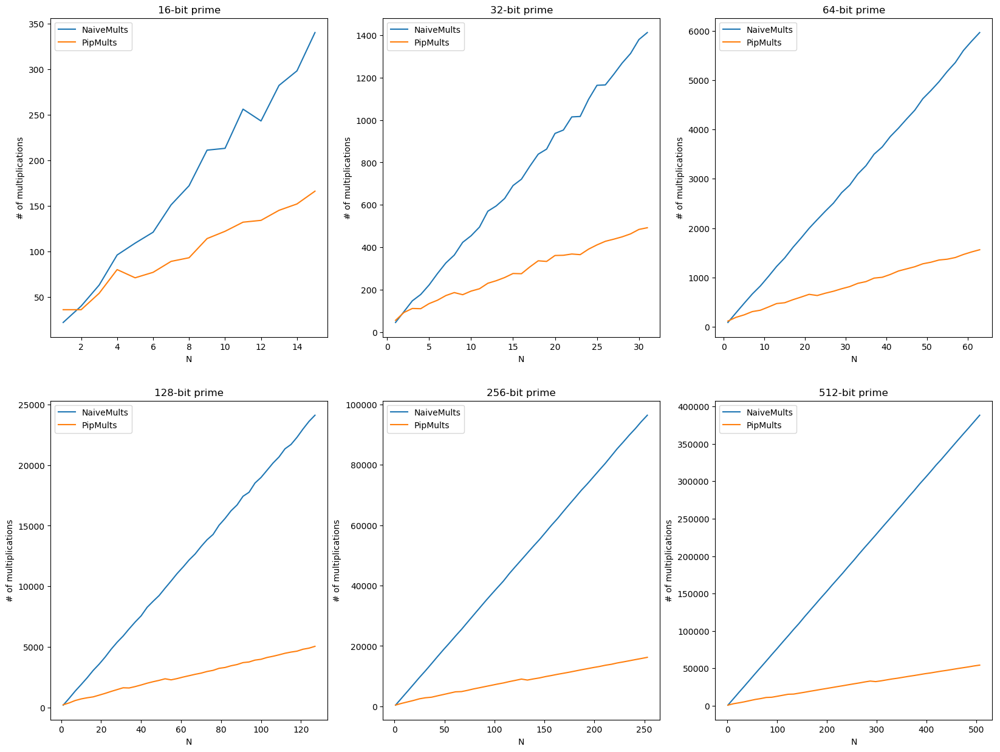
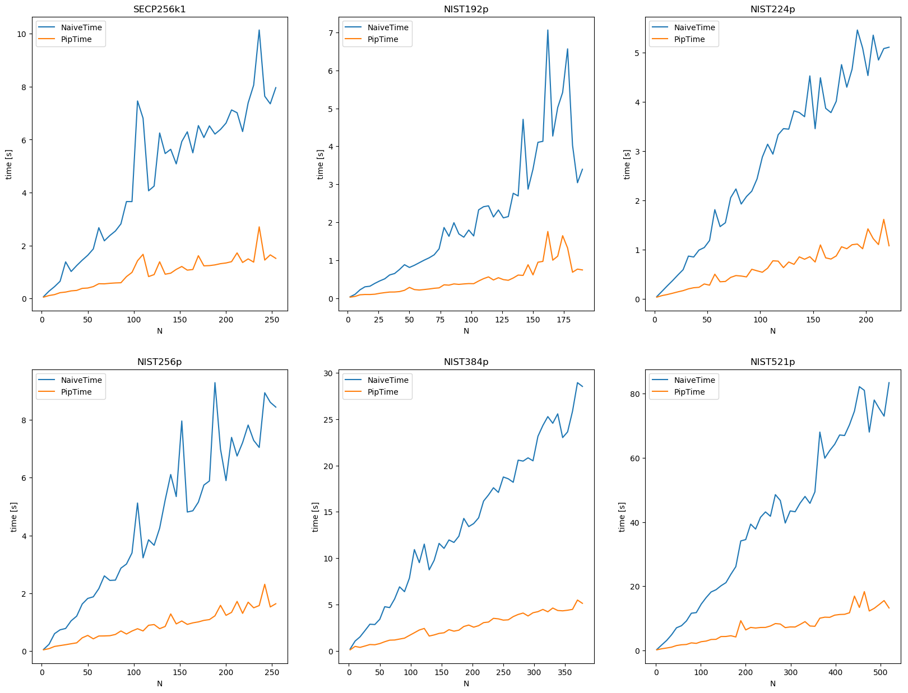

# python-pippenger
Python3 implementation of the Pippenger algorithm for fast multi-exponentiation following this [survey by Bootle](pippenger.pdf).

## Performances
We provide a benchmark for this algorighm in the case where the group `G` is:
- A prime order cyclic subgroup of the multiplicative group of integers mod `q`: `Z_q^*.`
- An elliptic curve with the usual group law.

### Integers mod q
Here we take safe primes `p, q=2p+1` and consider the cyclic subgroup of order `p` of `Z_q^*`. We select `N` random elements in this group, as well as `N` random exponents in `(0,p)`.

We then count the number of multiplications required to compute `prod_i=1^N g_i^e_i` using Pippenger's method or the naive one:
```python
def naive_multi_exp(gs, es):
    tmp = gs[0]**es[0]
    for i in range(1,len(gs)):
        tmp *= gs[i]**es[i]
    return tmp
```
Here are the results for `p` a prime with 16, 32, 64, 128, 256, and 512 bits:

We see that Pippenger's method requires far less multiplications. The time required for both methods is more or less the same since function calls in python are really slow.

### Elliptic curves
The number of multiplications (that we'll call additions for elliptic curves) is the same as for integers (it does not depend on the group in general).

Elliptic curves, however, have a far more expensive addition operation. Therefore, the savings in the total number of group operation yields great savings in time too.

We perform the same computation as before, this time measuring the time.

Here are the results for the curves SECP256k1, NIST192p, NIST224p, NIST256p, NIST384p, NIST521p:

We see that Pippenger's algorithm is much faster than the naive methods for all elliptic curves. This observation holds in general for groups where the group operation is expensive.